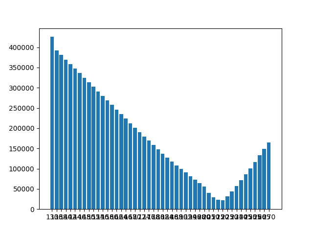

# open_interest

analyse the open interest  to identify the max pain level

Open interest is the number of contracts or commitments outstanding in futures and options trading on an official exchange at any one time.

For a deeper answer ho [here](https://www.investopedia.com/terms/o/openinterest.asp)
Futures in Germany are traded at the [EUREX](https://www.eurex.com/ex-de/)

In theory we can look at the open interest for a particular index or asset and see for which level, how many contracts have been sold and are still open. Assuming the writer of the contract has an interest to 'move' the underlying in a direction so that the contract is becomming worthless or at least the delta is as low as possible, then we can also assume, that the sum of writers has an interest to move the underlying to the level, where they loose as least as possible. That level is also called **max pain**.

To access the data:

```sh
schema = https
host = www.eurex.com
url = ex-de/marktdaten/statistik/online-marktstatistiken/100!onlineStats
```

There are a lot of underlyings which can be storred in [underlying.py](/underlying.py).

```python
COVESTRO = {"productId": 47410, "productGroupId": 9772}
ADIDAS = {"productId": 47634, "productGroupId": 9772}
ALLIANZ = {"productId":47910, "productGroupId": 9772}

DAX = {"productId": 70044, "productGroupId": 13394}
```

## Requirements

see also [requirements.txt](/requirements.txt):

* install beautifulsoup4
* install lxml
* install matplotlib

## Usage

Using the program at this point in time requires the manual modification of the "parameter". Hence, you need to specify an underlying as well as an expiry date.

Then there are thre main scripts prepared for

* update -> updates the data
* show_history -> gives a table with the history over the last trading days max pain points
* draw chart -> gives a chart visualizing the most recent distribution of value to strike

### show history

Here is a sample output when listing the history of an underlying

```sh
╒══════════╤══════════╤═══════════╕
│     Date │   Strike │     Value │
╞══════════╪══════════╪═══════════╡
│ 20230217 │    14600 │ 101270000 │
├──────────┼──────────┼───────────┤
│ 20230216 │    14600 │ 100156850 │
├──────────┼──────────┼───────────┤
│ 20230215 │    14500 │  97285600 │
├──────────┼──────────┼───────────┤
│ 20230214 │    14500 │  96242600 │
├──────────┼──────────┼───────────┤
│ 20230213 │    14500 │  96462950 │
├──────────┼──────────┼───────────┤
│ 20230210 │    14500 │  95447700 │
├──────────┼──────────┼───────────┤
│ 20230209 │    14500 │  94579450 │
├──────────┼──────────┼───────────┤
│ 20230208 │    14500 │  89270000 │
├──────────┼──────────┼───────────┤
│ 20230207 │    14500 │  87857700 │
├──────────┼──────────┼───────────┤
│ 20230206 │    14500 │  86014700 │
├──────────┼──────────┼───────────┤
│ 20230203 │    14500 │  86371600 │
├──────────┼──────────┼───────────┤
│ 20230202 │    14400 │  85127150 │
├──────────┼──────────┼───────────┤
│ 20230201 │    14400 │  83921350 │
╘══════════╧══════════╧═══════════╛
```

### draw chart

This is a sample chart, showing the distribution of the value over strike:


