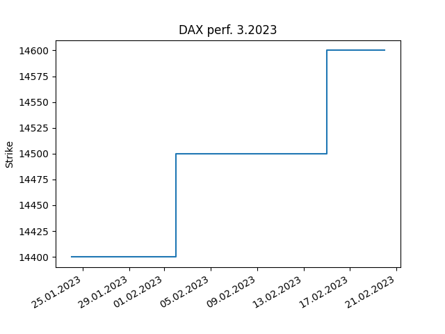
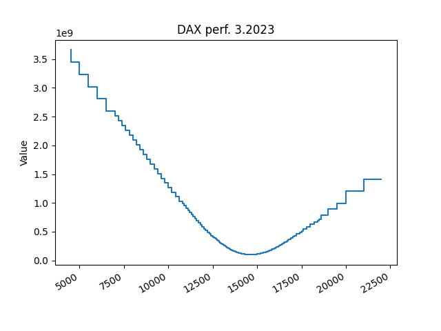

# open_interest

analyse the open interest  to identify the max pain level

Open interest is the number of contracts or commitments outstanding in futures and options trading on an official exchange at any one time.

For a deeper answer ho [here](https://www.investopedia.com/terms/o/openinterest.asp)
Futures in Germany are traded at the [EUREX](https://www.eurex.com/ex-de/)

In theory we can look at the open interest for a particular index or asset and see for which level, how many contracts have been sold and are still open. Assuming the writer of the contract has an interest to 'move' the underlying in a direction so that the contract is becoming worthless or at least the delta is as low as possible, then we can also assume, that the sum of writers has an interest to move the underlying to the level, where they loose as least as possible. That level is also called **max pain**.

To access the data:

```sh
schema = https
host = www.eurex.com
url = ex-de/marktdaten/statistik/online-marktstatistiken/100!onlineStats
```

There are a lot of underlying which can be stored in [underlying.py](underlying.py).

```python
COVESTRO = {"name": "Covestro", "productId": 47410, "productGroupId": 9772}
ADIDAS = {"name": "Addidas", "productId": 47634, "productGroupId": 9772}
ALLIANZ = {"name": "Allianz", "productId":47910, "productGroupId": 9772}

DAX = {"name": "DAX perf.", "productId": 70044, "productGroupId": 13394}
```

For each expiry date, create an entry in the [expiry.py](expiry.py)

```python
March_2023 = {"month": 3, "year": 2023, "date": "20230317"}
February_2023 = {"month": 2, "year": 2023, "date": "20230217"}
January_2023 = {"month": 1, "year": 2023, "date": "20230120"}
December_2022 = {"month": 12, "year": 2022, "date": "20221216"}
November_2022 = {"month": 11, "year": 2022, "date": "20231118"}
```

## Requirements

see also [requirements.txt](/requirements.txt):

* install beautifulsoup4
* install lxml
* install matplotlib

## Usage

Using the program at this point in time requires the manual modification of the "parameter". Hence, you need to specify an underlying as well as an expiry date.

```sh
usage: oi.py [-h] [-t T] [-u U] [-e E] [-b B]

Manage open interest data from www.eurex.de

optional arguments:
  -h, --help  show this help message and exit
  -t T        the task to perform, i.e. update
  -u U        the underlying, i.e. DAX
  -e E        the expiry, i.e. March_2023
  -b B        the date for which the date is requested, i.e. 20230222 (Feb 22nd, 2023)
```

### -t update

updates the data for the specified underlying and the specified expiry date

### -t list

Here is a sample output when listing the history of an underlying

```sh
╒══════════╤══════════╤═══════════╕
│     Date │   Strike │     Value │
╞══════════╪══════════╪═══════════╡
│ 20230217 │    14600 │ 101270000 │
├──────────┼──────────┼───────────┤
│ 20230216 │    14600 │ 100156850 │
├──────────┼──────────┼───────────┤
│ 20230215 │    14500 │  97285600 │
├──────────┼──────────┼───────────┤
│ 20230214 │    14500 │  96242600 │
├──────────┼──────────┼───────────┤
│ 20230213 │    14500 │  96462950 │
├──────────┼──────────┼───────────┤
│ 20230210 │    14500 │  95447700 │
├──────────┼──────────┼───────────┤
│ 20230209 │    14500 │  94579450 │
├──────────┼──────────┼───────────┤
│ 20230208 │    14500 │  89270000 │
├──────────┼──────────┼───────────┤
│ 20230207 │    14500 │  87857700 │
├──────────┼──────────┼───────────┤
│ 20230206 │    14500 │  86014700 │
├──────────┼──────────┼───────────┤
│ 20230203 │    14500 │  86371600 │
├──────────┼──────────┼───────────┤
│ 20230202 │    14400 │  85127150 │
├──────────┼──────────┼───────────┤
│ 20230201 │    14400 │  83921350 │
╘══════════╧══════════╧═══════════╛
```

### -t chart

shows a historic overview about how the max pain level is doing over time



### -t distribution

takes the most recent bus date and generates an distribution chart


